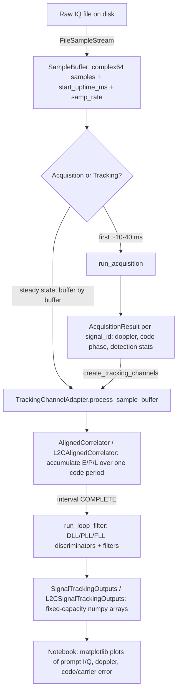

# Architecture

This document describes the current architecture of the `gnss-lectures` /
`gps-tracking-example` codebase as of commit `e56ca19` (2026-08-11). It is
descriptive (what exists today), not prescriptive — see
[plan-1.md](plan-1.md) for proposed changes.

## 1. Purpose and design intent

The project is a **pure-Python (+ Numba JIT) GNSS signal acquisition and
tracking framework**, built for teaching (Fall 2025 lecture set). The stated
goals, inferred from the code and README, are:

- **Easy to read and edit** — plain dataclasses, explicit state, minimal
  abstraction, notebooks as the primary "driver" code so students can see
  the whole pipeline.
- **Reasonably performant** — the only inner loop that runs per-sample
  (carrier wipeoff + code correlation) is JIT-compiled with Numba
  (`utils/bpsk_correlation.py`); everything else is plain NumPy/Python
  orchestration around it.
- **Signal-agnostic where practical** — GPS L1 C/A (single BPSK code) and
  GPS L2C (interleaved CM/CL codes) share almost all of their tracking-loop
  logic, differing mainly in how the correlator interprets the chip stream.

## 2. Repository layout

```
gps-tracking-example/
├── environment.yml          # conda env: pins Python 3.13 only
├── pyproject.toml           # poetry project; depends on ./submodules/gnss-tools + numpy/matplotlib/h5py/pyyaml/tqdm
├── poetry.lock
├── utils/                   # the framework itself (this repo's own package)
│   ├── sample_streaming.py       # raw file -> complex64 sample buffers
│   ├── collect_metadata_utils.py # YAML experiment/collect/channel config parsing
│   ├── bpsk_acquisition.py       # FFT-based parallel-code-phase acquisition
│   ├── bpsk_correlation.py       # Numba correlation kernels (the hot path)
│   ├── tracking_bpsk_aligned.py  # current tracking channel (single code, e.g. L1CA)
│   ├── tracking_l2c_aligned.py   # current tracking channel (interleaved CM/CL, L2C)
│   ├── signal_interfaces.py      # signal-family-agnostic facade over the two above
│   ├── tracking_bpsk.py          # LEGACY block-based tracker (superseded, unused)
│   └── tracking_consolidated.py  # UNFINISHED generalization attempt (unused, broken import graph)
├── notebooks/                # the "application layer" — acquisition/tracking drivers + plots
├── submodules/gnss-tools/    # sibling git repo: signal generation, RINEX/SP3/IONEX IO, coordinate/time math
└── local-data/               # gitignored: raw IQ collects, acquisition/tracking result caches
```

`utils/` is installed as an editable package (`[tool.poetry] packages =
[{include = "utils"}]`) so notebooks just `import utils`. There is no `src/`
layer and no `tests/` directory today.

## 3. External dependency: `gnss-tools`

`gnss-tools` (https://github.com/cu-sense-lab/gnss-tools) is a **separate
git repository** vendored as a submodule and installed as a normal Python
dependency (`gnss-tools @ ./submodules/gnss-tools` in `pyproject.toml`). It
is general-purpose GNSS infrastructure, not specific to this tracking demo:

- `gnss_tools.signals.*` — PRN code generators (`gps_l1ca`, `gps_l2c`,
  `gps_l1c`, `gps_l5`, `glo`) used by `signal_interfaces.py` to build the
  code sequences the tracker correlates against.
- `gnss_tools.time`, `gnss_tools.orbits`, `gnss_tools.rinex_io`,
  `gnss_tools.coords`, `gnss_tools.misc` — ephemeris/orbit/RINEX/IONEX
  parsing, PVT estimation, coordinate transforms, HDF5 helpers, etc. These
  are **not currently used** by anything in `utils/` or the notebooks (no
  PVT/positioning step exists yet in this repo) but are available for
  future navigation-solution work.

Notably, `gnss-tools`'s own `pyproject.toml` depends on `numba` and `scipy`,
and this repo's core tracking/acquisition code imports both directly
(`bpsk_correlation.py`, `bpsk_acquisition.py`, `tracking_bpsk_aligned.py`)
without declaring them as direct dependencies of this project — see
[plan-1.md](plan-1.md) §1.

## 4. End-to-end data flow



Concretely:

1. **`sample_streaming.FileSampleStream`** opens a raw IQ capture file and
   yields fixed-size `SampleBuffer`s of `complex64` samples, converting from
   whatever on-disk bit depth/packing (`SampleParameters`: 2/4/8/16/32-bit,
   signed/unsigned, real/complex, LSB/MSB ordering) via
   `convert_to_complex64_samples`. `collect_metadata_utils.py` loads a YAML
   description of available collects/channels/bands (with config
   inheritance) so notebooks can pick a file and its sample format by name
   instead of hardcoding parameters.
2. **Acquisition** (`bpsk_acquisition.run_acquisition`) takes one block of
   baseband samples and, for every candidate signal (e.g. all 32 PRNs of a
   family), performs FFT-based parallel-code-phase search across a Doppler
   grid, non-coherently combines `num_blocks` coherent integrations, and
   estimates a detection threshold from a chi-squared noise model
   (`prob_false_alarm` control). Replica codes and their FFTs are cached per
   signal in `AcquisitionConfiguration.replica_cache_dict` since they don't
   change between calls. Interleaved codes (L2C) get a special replica
   construction that zero-fills the chip slots belonging to the *other*
   code component so it doesn't spuriously correlate against it. Output is
   one `AcquisitionResult` per detected signal (Doppler bin, code-phase
   bin, normalized peak SNR, detection flag).
3. **Tracking channel construction**
   (`signal_interfaces.create_tracking_channels`) turns each
   `AcquisitionResult` into an initial `TrackingSignalState` (code phase,
   carrier phase/rate) and, via a small **strategy table**
   (`CorrelatorStrategyName.BPSK` → `tracking_bpsk_aligned.TrackingChannel`,
   `INTERLEAVED_BPSK` → `tracking_l2c_aligned.TrackingChannel`), builds the
   concrete tracking channel object, wrapped in a `TrackingChannelAdapter`
   that presents a uniform interface (`process_sample_buffer`,
   `.outputs`, `get_prompt_component`, etc.) regardless of which concrete
   channel type it holds.
4. **Steady-state tracking**: for every subsequent `SampleBuffer`, the
   driver code calls `adapter.process_sample_buffer(buffer)` for every
   active channel. Internally this is a **code-period-aligned** correlate/
   loop-filter loop — see §5.2.
5. **Outputs**: each completed correlation epoch appends one row to
   pre-allocated NumPy arrays (`SignalTrackingOutputs` /
   `L2CSignalTrackingOutputs`) inside the channel — prompt/early/late
   correlator values, discriminator errors, filtered carrier/code
   state, PLL/FLL mode. Notebooks read these arrays directly for plotting.

## 5. Core subsystems

### 5.1 Sample streaming (`sample_streaming.py`)

- `SampleParameters` fully describes an on-disk sample format (bit depth,
  complex/real, integer/float, signed/unsigned, I/Q bit ordering) including
  non-byte-aligned formats (2-bit and 4-bit packed samples), independent of
  any particular file.
- `convert_to_complex64_samples` is the (non-JIT) format-conversion
  function; it branches on bit depth and uses NumPy bit tricks
  (shift-and-view) to unpack sub-byte formats.
- `mixdown_samples` does a vectorized NumPy complex mixdown (used to shift
  an IF-centered capture to baseband before acquisition/tracking).
- `FileSampleStream` is a context-managed generator source:
  `sample_buffer_generator` reads fixed-size buffers (with an optional
  `skip` for decimated/sparse acquisition scanning), and
  `sample_block_generator` further slices a buffer into smaller
  sub-blocks.
- `SampleBuffer` is the unit passed to tracking: a `complex64` array plus
  `start_uptime_ms` and `samp_rate`, from which `stop_uptime_ms` is derived.
  "Uptime" (milliseconds since an arbitrary epoch) is the time base used
  everywhere in tracking, not wall-clock/GPS time.

### 5.2 Aligned tracking channel (`tracking_bpsk_aligned.py`, `tracking_l2c_aligned.py`)

This is the heart of the framework, and the two files are near-duplicates
(see [plan-1.md](plan-1.md) §2). The design is a **request-driven
correlator** pattern with a clean split of ownership:

- **`TrackingSignalState`** — the channel's dynamic state, valid at a
  specific `uptime_epoch_ms`: code phase (ms), code rate (ms/s), carrier
  phase (cycles), carrier rate (Hz). `propagate_phase`/
  `propagate_to_uptime_ms` extrapolate this state forward without mutating
  it.
- **`AlignedCorrelator` / `L2CAlignedCorrelator`** — owns only *static*
  configuration (`DelayDopplerCorrelatorConfig`: number of delay taps and
  spacing, e.g. Early/Prompt/Late at ±0.5 chip; number of Doppler bins,
  currently always 1 in practice) and a `corr_grid` accumulator. It does
  **not** own signal state — `accumulate()` is called by the channel with
  explicit `accum_start_uptime_ms`/`accum_stop_uptime_ms` bounds and the
  channel's current `signal_state`, computes exactly which samples of the
  given buffer fall in that half-open window, and calls the Numba kernel
  (§5.3) to accumulate carrier-wiped, code-correlated E/P/L values in
  place. It is explicitly documented as tolerant of being called multiple
  times across buffer boundaries for the same interval (partial
  accumulation).
- **`CorrelationInterval`** — tracks the *target* code-phase-ms window
  `[start_code_phase_ms, start_code_phase_ms + duration_ms)` for the
  current correlation epoch and converts it to absolute uptime bounds via
  the channel's current `signal_state`. `increment()` advances it by one
  period once an epoch completes.
- **`CorrelatorStatus`** (`CLEARED` / `PARTIAL` / `COMPLETE`) — the state
  machine that lets `process_sample_buffer` correctly resume a correlation
  interval that spans multiple `SampleBuffer`s: if the previous call left
  the interval `PARTIAL` and the new buffer's start is already past where
  that interval should have ended, the stale partial accumulation is
  discarded (non-contiguous buffer case) rather than silently used.
- **`TrackingLoopState`** — holds a small circular buffer of recent prompt
  correlator values (for FLL/PLL mode switching, via the "circular
  length" statistic `compute_prompt_corr_history_circ_length`, a coherence
  measure of the wrapped I/Q phase — high coherence signals the loop can
  switch from FLL to PLL).
- **`TrackingLoopParameters`** — user-facing DLL/PLL/FLL bandwidths, EPL
  spacing, `corr_period_ms` (integration time); `__post_init__` derives the
  actual first/second-order loop filter gains from bandwidth + update
  period (standard GNSS receiver loop design equations).
- **`TrackingChannel.process_sample_buffer`** — the main driver loop,
  called once per incoming `SampleBuffer`. It loops (`while True`):
  compute the current interval's uptime bounds → possibly discard a stale
  partial interval → accumulate against the current buffer → if the
  interval's stop time falls inside this buffer, the epoch is `COMPLETE`:
  run the loop filter (`run_loop_filter`) if any samples were actually
  accumulated, advance the interval, reset the correlator, and loop again
  (a single buffer can complete more than one code period); otherwise mark
  `PARTIAL` and return, waiting for the next buffer.
- **`run_loop_filter`** — for each completed epoch: pulls E/P/L out of the
  correlator grid, computes the Costas phase discriminator (PLL), a
  Costas-wrapped frequency discriminator normalized by elapsed time (FLL),
  and a normalized early-minus-late code discriminator (DLL); applies the
  loop filters computed in `TrackingLoopParameters`; updates
  `signal_state` (code phase/rate, carrier phase/rate) *in place, evaluated
  at the epoch's uptime*; and appends one row to the pre-allocated
  `SignalTrackingOutputs` arrays (silently no-ops once `output_index`
  reaches `capacity`).

`tracking_l2c_aligned.py` is the same design applied to L2C's
chip-interleaved CM/CL codes: its correlator grid gains a trailing
component axis (`corr_grid[:, :, 2]`), the discriminators are still driven
by CM only (component 0) while CL is accumulated and stored, and the E/P/L
arrays in `L2CSignalTrackingOutputs` are `(capacity, 2)` instead of
`(capacity,)`. Everything else — `CorrelationInterval`, `CorrelatorStatus`,
`TrackingLoopState`, `TrackingLoopParameters`, and the entire structure of
`process_sample_buffer`/`run_loop_filter` — is copy-pasted, not shared.

### 5.3 Correlation kernels (`bpsk_correlation.py`)

The only Numba-JIT code in the project, and the only genuinely per-sample
hot loop:

- `numba_correlate__multicomponent__complex64` — one kernel for every
  signal. For each input sample: multiply by the current conjugated carrier
  replica sample (carrier wipeoff), then for each of `num_bins` delay taps
  and each component, look up that component's chip at the tap's chip index
  and accumulate `±carrierless` (or a scaled add for non-±1 chip values)
  into `corr_values[j, c]`. Carrier phase is advanced by rotating
  `conj_carr_sample` by a precomputed `conj_carr_rotation` each sample
  (avoids a `sin`/`cos` call per sample). `correlate__multicomponent` is the
  thin Python wrapper that computes the initial conjugated carrier
  phasor/rotation, wraps the code phase into the pattern period, and calls
  the kernel.
- There is **no separate interleaved kernel**. Every component is stated on
  the signal's own chip axis and carries 0 where it does not transmit (see
  §5.1 of `code_components.py`'s module docstring), so the lookup is just
  `codes_flat[start[c] + chip_index % length[c]]` — no per-component rate,
  offset, modulo or divide in the inner loop. L2C's CM/CL multiplexing is
  carried by the zeros in the sequences themselves. Measured against the
  previous rate-and-offset form, per 1 ms of samples with 9 delay bins:
  L1 C/A 0.111 → 0.071 ms, L2C 0.144 → 0.113 ms, L5 1.137 → 0.662 ms
  (1.3–1.7×), with bit-identical output. The cost is memory, and only for a
  time-multiplexed signal: L2C's packed codes double, 777 kB → 1.55 MB per
  PRN.

The kernel is `@nb.jit(nopython=True, parallel=False)` with explicit
Numba type signatures on every argument (no signature caching via
`cache=True`, so each fresh process pays JIT warm-up on first call).

### 5.4 Acquisition (`bpsk_acquisition.py`)

Standard parallel-code-phase-search FFT acquisition:
`AcquisitionConfiguration` derives block/replica sizing and the Doppler
search grid (as FFT bin indices, from `min/max_search_doppler_hz` and the
FFT resolution implied by the replica duration) in `__post_init__`.
`run_acquisition` reshapes the input sample block into `M` non-coherent
blocks of `N` samples, computes `M` FFTs once, and for each signal and each
candidate Doppler bin, correlates via FFT multiply + IFFT and
non-coherently sums `|corr|²/N` across the `M` blocks. Detection uses a
chi-squared noise model (`2M` degrees of freedom) with a per-bin false
alarm probability derived from a target *total* false alarm probability
and the number of independent bins searched (Doppler bins × code-phase
samples) — a Bonferroni-style correction. Two noise-variance estimators are
offered (`abscorrmean`, `abscorrvar`).

### 5.5 Signal catalog (`signal_interfaces.py`)

This module lets notebooks be signal-agnostic, and separates three concerns
that used to be one flat dataclass (see `TODO_SIGNALS.md` for the rationale):
what a signal *is*, how it is *acquired*, and how it is *tracked*.

- `Link`/`LinkId` — the RF carrier (L1, L2, L5) a signal rides on, distinct
  from the signal itself (e.g. a future BOC sidelobe's `carrier_freq_hz` can
  differ from its link's `nominal_freq_hz`).
- `Signal` — an abstract class; each concrete subclass (`GpsL1CA`, `GpsL2C`,
  `GpsL5`) *is* the class-based definition of one signal type, carrying its
  `link`, `carrier_freq_hz`, `tracking_code_rate_chips_per_sec`, and a unique
  `signal_type_id` (e.g. `"GPS_L2C"`, matching the convention in
  `submodules/gnss-tools/gnss_tools/signals/catalog.py`). Instantiating a
  subclass for a PRN (e.g. `GpsL5(prn=1)`) builds that satellite's
  `code_set` from `gnss_tools.signals.*` code generators (applying the
  `1 - 2*bits` BPSK mapping) via `_build_components`, as plain
  `CodeComponent`s (see §5.3). A time-multiplexed signal states each component
  zero-filled on its sibling's chips — `_interleave` does this for L2C's
  CM/CL — so there is no per-component rate or offset anywhere.
  `build_signals(signal_type, prns)` builds a `{"G01": Signal, ...}` dict for a
  whole constellation.
- `AcquisitionPolicy`/`ACQUISITION_POLICIES` and
  `TrackingPolicy`/`TRACKING_POLICIES` — deliberately *not* fields on
  `Signal`. Acquisition typically locks onto a single component (L2C
  acquires on CM alone even though tracking uses CM and CL together), and
  discriminator/loop policy is a tracking-strategy choice independent of the
  signal's own structure — both live in module-level dicts keyed by
  `signal_type_id`. `build_acquisition_code_params(signal_type, signals)` and
  `create_tracking_channels(signal_type, signals, ...)` look policy up from
  there rather than reading it off the signal.
- **What acquisition cannot locate is policy too.** `AcquisitionPolicy` also
  carries `include_overlay` — fold the component's tiered (overlay) code into
  the replica rather than let it break coherence, which is how L5 acquires on
  Q × NH20 — and `ambiguous_component`, the component whose period is longer
  than the acquisition code's and which the dwell therefore leaves unlocated
  (L2C's CL, 75 CM periods long). `build_ambiguity_search(signal_type, signal)`
  derives the hypothesis search from those two facts plus the signal's own
  code spans, and `resolve_acquisition_ambiguities(...)` scores the candidates
  over the same dwell acquisition already used, with the same coherent block
  structure, so each hypothesis takes exactly the Doppler loss acquisition
  survived. `create_tracking_channels` folds a confident result into the
  seeded code phase and, via `TrackingPolicy.resolved_discriminator_policy`,
  can move the loops onto the newly usable component. When the acquisition code
  spans a whole overlay period (`acquisition_resolves_overlay_phase`), the
  recovered code phase carries the overlay counter outright and the channel
  starts already synced — no search at all.
- `TrackingPolicy.synced_coherent_integration_ms` is a *duration*, not a count
  of primary code periods: one epoch serves every component, so the post-sync
  length is bounded by the shortest data symbol in the signal (10 ms for L5,
  I's CNAV symbol) rather than by the pilot's overlay period.
- `TrackingChannelAdapter` — the object notebooks actually hold: wraps a
  concrete `tracking_channel.TrackingChannel` + the `Signal` that configured
  it, and exposes `get_prompt_component`/`get_early_component`/
  `get_late_component` over the channel's `(capacity, num_components)`
  output arrays (see `SignalTrackingOutputs` in `tracking_channel.py`) --
  single- and multi-component signals are shaped the same way, so no
  per-family branching is needed here.

### 5.6 Collect metadata (`collect_metadata_utils.py`)

A YAML-driven description of "experiments": named `band_configurations`
(RF center/IF frequencies), `channel_configurations` (sample rate, which
bands are present, on-disk `SampleParameters`, with an `inherit` mechanism
for config reuse/override), and `collects` (a data file + which channel
config it was recorded with). This is metadata *about capture files on
disk*, not a runtime component of tracking itself; it exists to keep
notebooks from hardcoding sample-format details per collect. Also includes
a `plot_receiver_channel_bands` matplotlib helper for visualizing which
bands/channels are available in an experiment.

### 5.7 Legacy / unfinished code

- **`tracking_bpsk.py`** — an earlier, non-code-aligned tracker: it
  processes fixed-duration sample *blocks* (not code-period-aligned
  intervals) and recomputes discriminators once per block via
  `track_signal`/`TrackingChannel.process_sample_block`. Not imported by
  any notebook or by `signal_interfaces.py`. Superseded by
  `tracking_bpsk_aligned.py`.
- **`tracking_consolidated.py`** — an in-progress attempt to generalize
  tracking across signal types via an abstract `TrackingSignalState` base
  class and a `Correlator`/`CorrelatorConfig` with an explicit
  `num_components` axis (a more general version of what
  `tracking_l2c_aligned.py` hand-rolls). It is incomplete: `Correlator`
  references `TrackingSignalParameters` and `signal_state.code_rate_ms_per_sec`
  /`carrier_rate_cyc_per_sec` that are never defined in this file, and the
  file has no `TrackingChannel`. Not imported anywhere. Appears to be an
  earlier draft of the generalization that `signal_interfaces.py`
  ultimately solved a different way (a strategy dict over two concrete,
  duplicated implementations rather than one generic implementation).

## 6. Notebooks (application layer)

Notebooks are the primary way this framework is *used*, not just
demonstrated:

| Notebook | Role |
|---|---|
| `gps-acq-track-configurable.ipynb` | Current, consolidated driver: config → load collect → acquire (`bpsk_acquisition`) → build channels (`signal_interfaces.create_tracking_channels`) → stream buffers → plot. Toggle between L1CA/L2C via one `SignalFamily` variable. This is the reference example for the current architecture. |
| `gpsl1ca-acquisition-example.ipynb`, `gpsl2c-acquisition-example.ipynb` | Acquisition-only walkthroughs, one per family. |
| `gpsl1ca-tracking-example.ipynb`, `gpsl2c-tracking-example.ipynb` | Tracking walkthroughs using the aligned channels directly (not through `signal_interfaces`), one per family. |
| `gpsl1ca-plot-tracking.ipynb`, `gpsl2c-plot-tracking.ipynb` | Plotting-focused notebooks over previously-produced tracking outputs. |
| `test-bpsk-correlations.ipynb`, `test-raw-samples.ipynb` | Ad hoc correlator/sample-format sanity checks (not a `pytest` test suite — there is no automated test suite in this repo). |

The per-family example notebooks and the newer configurable notebook
overlap substantially; the configurable notebook is the newest and most
complete (it alone imports `signal_interfaces`).

## 7. Cross-cutting design patterns worth naming

- **Request-driven correlator**: correlators never track "where they are"
  in the signal — the channel always tells them the exact interval to
  accumulate against, computed fresh from current `signal_state`. This
  makes the correlator trivially resettable/reusable and keeps all
  temporal bookkeeping in one place (`CorrelationInterval` +
  `CorrelatorStatus`).
- **Dataclasses as the state/parameter vocabulary**: essentially every
  piece of configuration or mutable state is a plain `@dataclass`
  (`TrackingSignalState`, `TrackingLoopParameters`, `SampleParameters`,
  `AcquisitionConfiguration`, ...), often with `__post_init__` deriving
  cached/computed fields. This is a deliberate readability choice — state
  is always inspectable and printable, at some cost of duplicated
  boilerplate across the two tracking-channel implementations.
- **Protocols over inheritance for polymorphism**: `signal_interfaces.py`
  unifies the two concrete tracking-channel types via structural
  `Protocol`s rather than a shared base class, so the concrete
  implementations don't need to know about each other.
- **Silent-drop-on-overflow outputs**: both `SignalTrackingOutputs` and
  `L2CSignalTrackingOutputs` pre-allocate fixed-capacity arrays sized by
  `output_capacity` at channel construction time, and simply stop writing
  once full (`if idx < capacity`). There is currently no warning when this
  happens.
